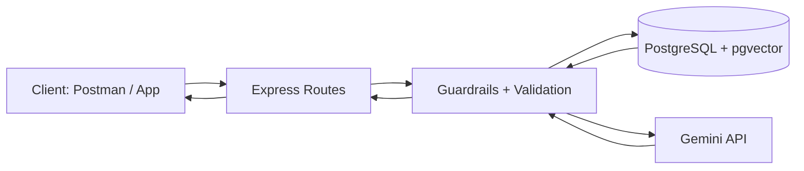
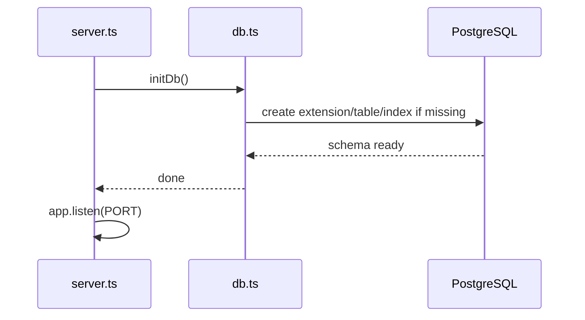
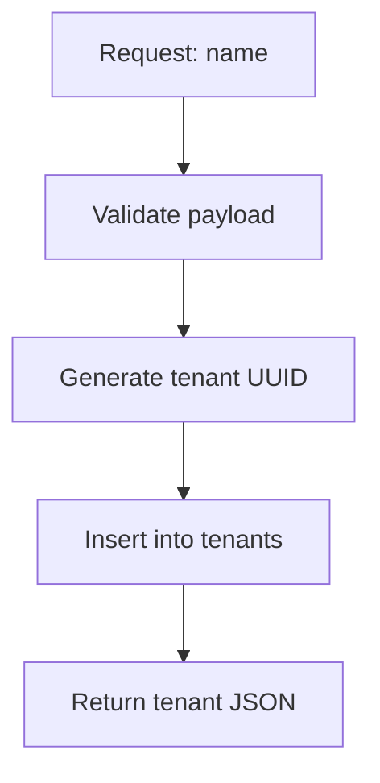
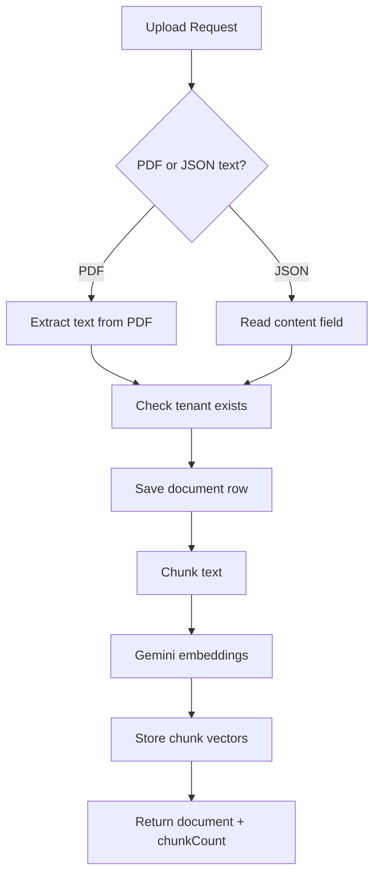
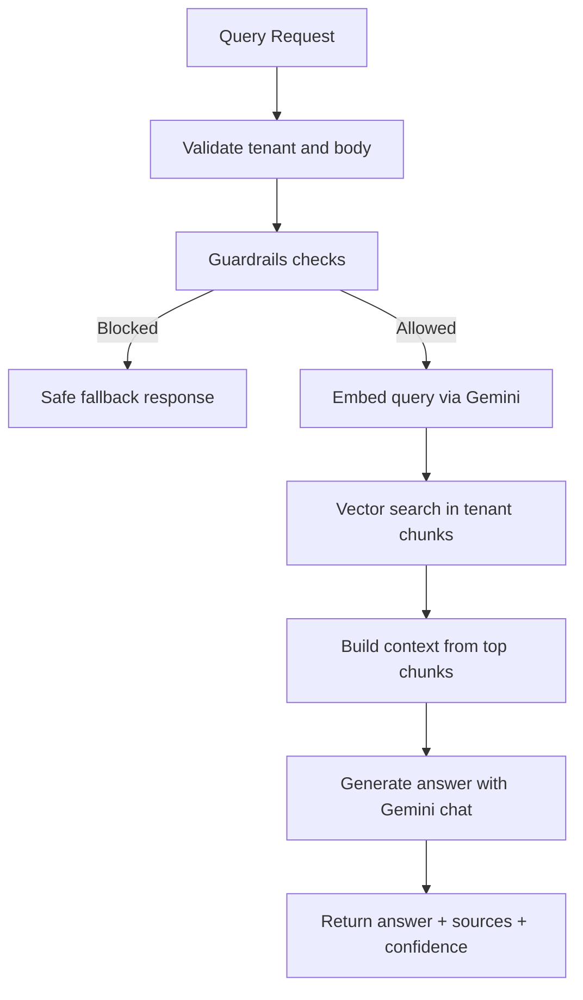

# Complete Project Guide: Multi-Tenant RAG Backend

## 1. Project Objective
Build a Retrieval-Augmented Generation backend where multiple tenants can:
- upload knowledge (text/PDF)
- query only their own data
- receive safe responses with guardrails

This project is implemented using:
- Node.js + TypeScript
- Express
- PostgreSQL + pgvector
- Google Gemini API (embeddings + answer generation)

---

## 2. High-Level Architecture



---

## 3. Project Structure

```text
project/
  src/
    api/
      routes.ts
    middleware/
      asyncHandler.ts
      errors.ts
    models/
      types.ts
    rag/
      ragService.ts
      guardrails.ts
    services/
      db.ts
      repositories.ts
      llmClient.ts
      pdf.ts
    tests/
      api.integration.test.ts
      guardrails.test.ts
      repositories-isolation.test.ts
    app.ts
    server.ts
  README.md
  ARCHITECTURE.md
  PROJECT_WORKFLOW.md
  COMPLETE_PROJECT_GUIDE.md
```

---

## 4. Data Model

### `tenants`
- `id UUID PRIMARY KEY`
- `name TEXT NOT NULL`
- `created_at TIMESTAMPTZ DEFAULT NOW()`

### `documents`
- `id UUID PRIMARY KEY`
- `tenant_id UUID REFERENCES tenants(id) ON DELETE CASCADE`
- `file_name TEXT NOT NULL`
- `raw_text TEXT NOT NULL`
- `created_at TIMESTAMPTZ DEFAULT NOW()`

### `chunks`
- `id UUID PRIMARY KEY`
- `tenant_id UUID REFERENCES tenants(id) ON DELETE CASCADE`
- `document_id UUID REFERENCES documents(id) ON DELETE CASCADE`
- `chunk_text TEXT NOT NULL`
- `embedding VECTOR NOT NULL`

---

## 5. End-to-End Workflows

## 5.1 Boot Workflow



Steps:
1. Server starts.
2. DB initialization runs.
3. Required schema is ensured.
4. API starts listening.

---

## 5.2 Tenant Creation Workflow (`POST /tenant`)



Steps:
1. Validate `name`.
2. Create UUID.
3. Insert tenant in DB.
4. Return created tenant.

---

## 5.3 Document Ingestion Workflow (`POST /tenant/:tenantId/documents`)



Steps:
1. Verify tenant exists.
2. Accept either:
- JSON (`fileName`, `content`)
- PDF upload (`multipart/form-data`)
3. Extract plain text.
4. Save full document.
5. Chunk text.
6. Generate embedding for each chunk.
7. Store chunks in pgvector table.
8. Return ingestion result.

---

## 5.4 Query Workflow (`POST /tenant/:tenantId/query`)



Steps:
1. Check tenant exists.
2. Validate query payload.
3. Run guardrails:
- prompt injection
- out-of-scope
4. If blocked: return fallback.
5. If allowed: embed query.
6. Search top chunks (tenant-scoped).
7. Build context and generate answer.
8. Return answer + citations + confidence.

---

## 6. Tenant Isolation Mechanism

Isolation is enforced at query level:
- document list and delete always filtered by `tenant_id`
- chunk retrieval filtered by `tenant_id`
- join between `chunks` and `documents` includes tenant match

Result:
- Tenant A cannot retrieve Tenant B chunks/documents.

---

## 7. Guardrails

Implemented guardrails:
1. Prompt injection detection
2. Out-of-scope detection
3. Low-confidence fallback in query response

If triggered:
- API returns safe fallback with `confidence: 0`.

---

## 8. API Endpoints

1. `GET /health`
2. `POST /tenant`
3. `GET /tenant/:id`
4. `POST /tenant/:tenantId/documents`
5. `GET /tenant/:tenantId/documents`
6. `DELETE /tenant/:tenantId/documents/:documentId`
7. `POST /tenant/:tenantId/query`

---

## 9. Runtime Configuration

`.env` variables:
- `PORT`
- `DATABASE_URL`
- `GEMINI_API_KEY`
- `EMBEDDING_MODEL` (e.g. `gemini-embedding-001`)
- `CHAT_MODEL` (e.g. `gemini-2.5-flash`)

---

## 10. Testing Strategy

Automated tests cover:
- guardrails logic
- repository tenant filtering constraints
- API integration behavior for tenant-scoped access

Run:
```bash
npm run typecheck
npm test
```

---

## 11. Manual Validation Checklist

1. Create Tenant A and B.
2. Upload different documents to each.
3. Query Tenant A about Tenant A data.
4. Query Tenant B about Tenant B data.
5. Ask Tenant A about Tenant B-only topic.
6. Confirm no cross-tenant source leakage.
7. Repeat reverse check.

---

## 12. Operational Notes

- DB schema auto-initializes on startup.
- PDF ingestion uses in-memory upload parsing.
- Embedding dimensions must remain consistent in stored chunks.
- If embedding model changes, clear old chunks/documents before re-ingesting.

---

## 13. Quick Summary

This system is a tenant-safe RAG backend:
- PostgreSQL + pgvector stores tenant-scoped chunks
- Gemini handles embeddings and answer generation
- Express APIs orchestrate upload/query flows
- Guardrails and SQL filters prevent unsafe or cross-tenant responses
