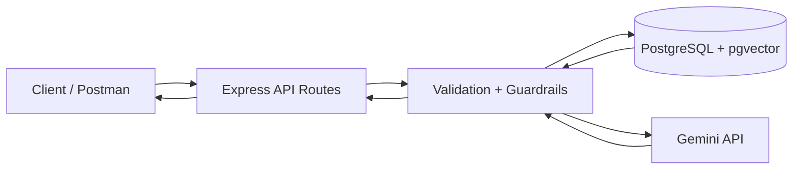

# Multi-Tenant RAG Project Workflow

## 1. What This Project Does
This backend lets multiple tenants (organizations) upload their own documents and ask questions over only their own data.

Core goals:
- Tenant isolation
- Vector retrieval with `pgvector`
- LLM answer generation with Gemini
- Basic guardrails

## 2. High-Level Architecture



## 3. Request Pipelines

### 3.1 Tenant Creation Pipeline
1. Client calls `POST /tenant`
2. Request body validated (`name`)
3. Tenant row inserted into `tenants`
4. Created tenant returned

### 3.2 Document Upload Pipeline
1. Client calls `POST /tenant/:tenantId/documents`
2. Server checks tenant exists
3. Accepts either:
- JSON text (`fileName`, `content`)
- PDF file (`multipart/form-data`) and extracts text
4. Stores document in `documents`
5. Splits text into chunks
6. Generates embeddings for chunks via Gemini embedding model
7. Stores chunk text + vector in `chunks`
8. Returns document + ingestion info

### 3.3 Query Pipeline
1. Client calls `POST /tenant/:tenantId/query`
2. Server checks tenant exists
3. Guardrails run:
- prompt injection check
- out-of-scope check
4. Query embedding generated via Gemini
5. Vector search in `chunks` filtered by `tenant_id`
6. Top chunks become context
7. Gemini chat model generates final answer from context
8. Response includes:
- `answer`
- `sources`
- `confidence`

## 4. Multi-Tenant Isolation Design
- Every document/chunk stores `tenant_id`
- All retrieval SQL filters by tenant
- Chunk/document joins enforce same tenant
- Cross-tenant access does not happen in normal query flow

## 5. Data Model

### `tenants`
- `id UUID PK`
- `name TEXT`
- `created_at TIMESTAMPTZ`

### `documents`
- `id UUID PK`
- `tenant_id UUID FK -> tenants(id)`
- `file_name TEXT`
- `raw_text TEXT`
- `created_at TIMESTAMPTZ`

### `chunks`
- `id UUID PK`
- `tenant_id UUID FK -> tenants(id)`
- `document_id UUID FK -> documents(id)`
- `chunk_text TEXT`
- `embedding VECTOR`

## 6. Folder Structure

```text
src/
  api/
    routes.ts                # REST endpoints
  middleware/
    asyncHandler.ts          # async error wrapper
    errors.ts                # 404 + global error handler
  models/
    types.ts                 # TypeScript interfaces
  rag/
    ragService.ts            # chunking, embedding, retrieval, answer generation
    guardrails.ts            # safety checks
  services/
    db.ts                    # pg pool + schema init
    repositories.ts          # SQL repository layer
    llmClient.ts             # Gemini embedding/chat client
    pdf.ts                   # PDF text extraction
  tests/
    guardrails.test.ts
    repositories-isolation.test.ts
    api.integration.test.ts
```

## 7. Endpoints Summary
- `GET /health`
- `POST /tenant`
- `GET /tenant/:id`
- `POST /tenant/:tenantId/documents`
- `GET /tenant/:tenantId/documents`
- `DELETE /tenant/:tenantId/documents/:documentId`
- `POST /tenant/:tenantId/query`

## 8. Important Environment Variables
- `PORT`
- `DATABASE_URL`
- `GEMINI_API_KEY`
- `EMBEDDING_MODEL` (recommended: `gemini-embedding-001`)
- `CHAT_MODEL` (recommended: `gemini-2.5-flash`)

## 9. Typical Test Flow (Manual)
1. Create Tenant A and Tenant B
2. Upload different docs to each
3. Query A for A topic
4. Query B for B topic
5. Query A for B topic and verify no B source appears
6. Query B for A topic and verify no A source appears

## 10. One-Line Technical Summary
This is a tenant-scoped RAG backend where Gemini creates embeddings + answers, pgvector retrieves relevant tenant-only chunks, and Express APIs orchestrate ingestion/query safely.
